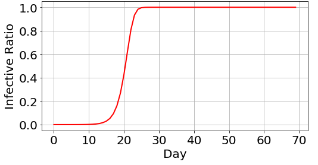
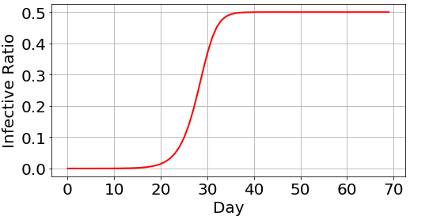
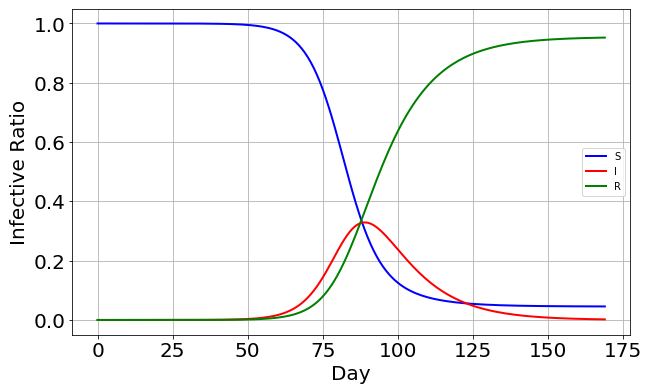

## Dynamic Python Model of Infectious Diseases

Python implementation of SI, SIR, SIS SEIR.

$N$-population

$i=I/N$ - infection ration

$s=S/N$ - susceptible ration

$r=R/N$ - removed ration

+ SI model
  
  [ S ] -- $\lambda$ --> [ I ]

  $\frac{di}{dt} = \lambda i (1-i)$
  
  

+ SIS model
  
  [ S ] -- $\lambda$ --> [ I ]

  [ S ] <-- $\gamma$ -- [ I ]

  $\frac{di}{dt} = \lambda i (1-i) - \gamma i$
  
  

+ SIR model

  [ S ] -- $\lambda$ --> [ I ] -- $\gamma$ --> [R]

  $\frac{ds}{dt} = -\lambda i s$

  $\frac{di}{dt} = \lambda i s - \gamma i$
  
  $\frac{dr}{dt} = \gamma i$

  

+ SEIR model

  [ S ] -- $\lambda$ -->[ E ]-- $\sigma$ --> [ I ] -- $\gamma$ --> [R]

  $\frac{ds}{dt} = -\lambda i s$

  $\frac{de}{dt} = \lambda i s - \sigma e$

  $\frac{di}{dt} = \sigma e - \gamma i$
  
  $\frac{dr}{dt} = \gamma i$

  
